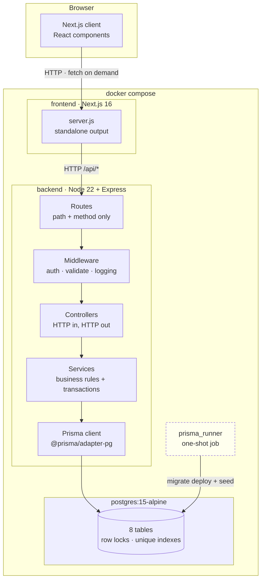

# Architecture

How Dhaka Tesla Pool is put together, and why it is built this way rather
than the way a system of this size could be.

The companion document is [`database-design.md`](./database-design.md), which
covers the schema. This one covers the system around it.

## 1. System shape



Four moving parts, and only three of them stay up.

**`prisma_runner` is a job, not a service.** It runs `migrate deploy` and
`db seed`, then exits 0. It is drawn dashed because it should be
`Exited (0)` in `docker compose ps`; that is success, not a failure.

Everything else is a straight line: HTTP arrives, a route matches it,
middleware runs, a controller adapts it, a service decides what should
happen, Prisma writes it. There is no message bus on the way, because
nothing in the system is asynchronous — see §4.

### Request path in detail

A passenger creating a ride request, `POST /api/rides`:

| Layer | File | What it does |
| --- | --- | --- |
| Route | `src/routes/rideRequest.route.ts` | Matches `POST /`, attaches middleware and the handler. Contains no logic. |
| Middleware | `auth.middleware.ts` | Verifies the bearer token, sets `req.user` |
| Middleware | `auth.middleware.ts` | `authorize("PASSENGER")` — rejects a driver |
| Middleware | `validate.ts` | Runs `createRideRequestSchema` (Zod); rejects bad input with 400 |
| Controller | `src/controllers/rideRequest.controller.ts` | Checks `req.user` exists, calls the service, wraps the result in `{ success, data }` |
| Service | `src/services/rideRequest.service.ts` | Owns the rules: one active ride per passenger, opens the transaction, writes the row and a history entry |
| Prisma | `src/lib/prisma.ts` | Driver-adapter client; issues the SQL |

## 2. Layering

Five layers, in strict one-way order. A layer may import from the one below
it and never from the one above.

```
Route  →  Middleware  →  Controller  →  Service  →  Prisma  →  PostgreSQL
```

| Layer | Count | Responsibility | Must not |
| --- | --- | --- | --- |
| `routes/` | 7 | Map method + path to middleware + handler | Contain business rules |
| `middleware/` | 4 | Cross-cutting: auth, role checks, Zod validation, logging, error shaping | Touch the database |
| `controllers/` | 7 | Translate HTTP to a service call and back | Contain business rules or Prisma |
| `services/` | 9 | All business rules, all transactions | Import `express` types |
| `src/lib/prisma.ts` | 1 | The only place a Prisma client is constructed | Be imported by routes or middleware |

Two conventions make the boundary real rather than aspirational:

- **Controllers are thin and uniform.** Each one guards `req.user`, delegates,
  and returns `res.status(n).json({ success, data })`. The response envelope
  is identical everywhere, which is why the frontend's `api.ts` can unwrap it
  without special-casing.
- **Only services open transactions.** A `$transaction` appears in the
  services and nowhere else. That is what keeps "a write and the rule that
  justifies it happen together" true by construction rather than by
  discipline.

### Route registration order

`src/routes/rideRequest.route.ts` registers `/me` and `/open` before `/:id`.
Express matches in order, so a literal path registered after `/:id` is
unreachable — `/me` would be read as an `:id`. Single-segment literals always
come first. It is commented in the file because it is invisible until it
breaks.

## 3. Why there is no Redis, no queue, and no microservices

The brief for this project explicitly rules out over-engineering. These are
the mechanisms that were considered and deliberately left out, with the
reason each is genuinely unnecessary here rather than merely deferred.

### No Redis

Redis earns its place when state must outlive a process or be shared across
processes. Every piece of state in this system is either already in
PostgreSQL or stateless:

- **Sessions.** JWTs are self-signed and verified against a shared secret
  (`src/utils/jwt.ts`). There is no server-side session to look up, so any
  instance can authenticate any token. A session store would add a lookup and
  a failure mode without adding information.
- **Driver availability.** `User.isOnline` is a boolean column, read fresh on
  every matching query. This is the classic candidate for a Redis set, and a
  Redis set would be a genuine improvement at high write rates — but at this
  scale a column read inside a transaction is both correct and free.
- **Caching.** There is no cache. Every read is a primary-key or indexed
  lookup, and the data is small enough to live in PostgreSQL's buffer cache.
  A cache in front of a database that is already fast enough is a second
  thing to invalidate.

### No job queue

A queue decouples work from the request that triggered it. There is no work
to decouple. `setInterval` appears zero times in the repository, and the only
`setTimeout` is a sleep in a test. The heaviest thing the system does — fare
calculation and the wallet debit — runs inline inside the same transaction
that moves the pool to `COMPLETED` (`src/services/poolLifecycle.service.ts`).

That is a deliberate trade. A queue would let the HTTP response return before
payment settled, which is better under load, but it would also mean a fare
could fail after the user was told the ride was complete. For this
application, settling before responding is the more honest behaviour.

### No microservices

One deployable backend, not a fleet of services around a pool, a payment, a
notification and a matching service. The boundaries do not pay for
themselves because they are not independent:

- Matching and pool lifecycle share a transaction and lock the same row.
  Splitting them means a distributed transaction or an eventual-consistency
  gap in exactly the place where correctness matters most.
- Fare and payment touch the same `ride_requests` row and the same wallet.

The seams that do exist — `payment.service.ts`, `zone.service.ts` — are
service modules, not services. The code is arranged so they could be
extracted, but nothing forces the split.

### Not omitted: simulated features

Two things are simulated rather than integrated, which is a different thing
from over-engineering and is called out so it is not mistaken for a real
integration:

- **Payments** are an internal `users.walletBalance` column. Transaction IDs
  are generated in-process. There is no gateway.
- **Geocoding** does not exist. `Zone` has no coordinates; distances come from
  a hand-written table. See
  [`database-design.md`](./database-design.md#distance-without-coordinates).

No email, SMS or push provider is called anywhere.

## 4. Concurrency, and why the database is enough

This is the load-bearing decision in the whole system: **the only thing
arbitrating two simultaneous requests is PostgreSQL.**

Seat capacity is claimed with a conditional `UPDATE` inside an interactive
transaction (`src/services/pool.service.ts`):

```ts
const result = await tx.pool.updateMany({
  where: {
    id: poolId,
    status: PoolStatus.OPEN,
    availableSeats: { gte: rideRequest.seatsRequested },
  },
  data: { availableSeats: { decrement: rideRequest.seatsRequested } },
});
if (result.count === 0) throw new AppError("Not enough seats left in this pool", 409);
```

No `SELECT ... FOR UPDATE`, no explicit `isolationLevel` (so PostgreSQL's
default `READ COMMITTED` applies), no advisory lock, no application-level
mutex. Under `READ COMMITTED`, a writer blocked on a row lock re-evaluates its
`WHERE` against the version the winner committed. The loser's predicate no
longer matches, `count` is 0, and the transaction rolls back.

**The check and the write are the same statement, so they cannot disagree.**
That is the whole argument, and it is why no distributed lock is needed — the
arbitrator is the database, and the database is already shared by every
instance.

The same pattern guards every other race:

| Race | Guard |
| --- | --- |
| Two drivers claim the last seat | conditional `updateMany` on `availableSeats >= seats` |
| Two drivers accept one passenger | conditional `updateMany` on `status: REQUESTED` |
| A lifecycle action beats a cancel | conditional `updateMany` on the expected `status` |
| Double-join a pool | unique index `pool_memberships_poolId_userId_key` |
| Double-pay a ride | unique index `payments_rideRequestId_key` |
| Overspend the wallet | conditional `updateMany` on `walletBalance >= fare` |

Lock order is consistent across all of them — pool row, then ride request row
— so two transactions touching overlapping rows cannot deadlock.

`tests/integration/concurrentSeatClaim.test.ts` verifies this against a real
database, including taking a row lock from a separate connection and
asserting the service call stays blocked until it is released.

## 5. Scaling

### What already works

The backend is stateless per request, and all correctness lives in the shared
database. There is no in-memory cache, no `Map` or `Set` of live state, no
session store, and no leader election. Running two or more instances requires
no code change, because nothing in a request depends on which process handled
the previous one.

### What actually limits it

**PostgreSQL connections, and nothing else.** `src/lib/prisma.ts` constructs
`new PrismaPg({ connectionString })` with no pool configuration, so it takes
`pg`'s defaults — `max: 10` connections per process. An interactive
transaction holds a checked-out connection for its whole duration, so the
effective ceiling is **10 concurrent transactions per process**.

Against stock `postgres:15-alpine` (`max_connections = 100`), roughly nine
instances exhaust the server. `connect_timeout` is `0` and no
`statement_timeout` is set, so an over-subscribed instance blocks silently
rather than failing fast.

The fix for this is **PgBouncer**, not Redis. A transaction-pooling mode
proxy decouples the number of backend processes from the number of database
connections. It is absent today because at the scale this is being built for,
one instance is the target — but it is the first thing to add before scaling
horizontally, and it is a deployment change rather than a code change.

### What would be added at 100k drivers

Not built, and listed so the gap is visible rather than discovered:

- **PgBouncer** in transaction mode, as above.
- **A real distance source.** The static zone-pair table in `fareConfig.ts`
  cannot be extended to arbitrary zones, and `zones` has no coordinates to
  compute from.
- **A real payment gateway.** The wallet column does not survive a genuine
  settlement requirement.
- **Live updates.** There is no WebSocket or SSE. The frontend fetches on
  demand, so a passenger does not see their ride matched without a refresh.
  This is a UX gap, and it is also the one place a real-time transport
  (WebSocket, or a Redis-backed pub/sub) would genuinely earn its keep.

## 6. Known limitations

Stated plainly, because two of them are real defects rather than
shortcomings.

### Two invariants are checked outside the transaction

Both are read-then-write checks with no database constraint behind them, and
both reproduce in a **single** process, because every `await` is a yield
point:

1. **One active ride request per passenger.** `rideRequest.service.ts` does
   a `findFirst` for an existing active request, then creates in a separate
   transaction. Two concurrent `POST /api/rides` from the same passenger can
   both pass the check. There is no partial unique index on
   `ride_requests(passengerId) WHERE status IN (...)`.
2. **One active pool per driver.** `pool.service.ts` reads `activePool`
   outside the transaction, then inserts unconditionally. Two concurrent
   accepts by the same driver can each create a pool.

The fix is a partial unique index in PostgreSQL — no lock, no new
infrastructure — but it is a schema migration and is out of scope here.

### No `CHECK` constraints

`availableSeats >= 0`, `seatCapacity > 0` and `seatsRequested > 0` are all
trusted to application code. A bug in a service could write a negative seat
count, and the database would accept it. See
[`database-design.md`](./database-design.md#constraints-that-exist).

### Other gaps

- `Pool` and `RideStatus` are two enums that share five of six members:
  `PoolStatus` has `OPEN` where `RideStatus` has `REQUESTED`.
  `ride_status_history.status` is typed `RideStatus`, and the code writes
  ride-level values into it (with `poolId` also set, so a row can reference
  both). A genuinely pool-level transition — a pool opening, or being
  cancelled with no ride attached — has no representable value, so that
  history is simply not recorded.
- `pool_memberships.userId` is denormalized and nothing enforces that it
  matches `ride_requests.passengerId`.
- The frontend has no automated test suite. The backend has 46.

## See also

- [`database-design.md`](./database-design.md) — schema, ERD, constraints
- [`testing.md`](./testing.md) — how the concurrency guarantees are verified
- [`demo.md`](./demo.md) — walkthrough and demo credentials
- [`../README.md`](../README.md) — setup and design decisions
