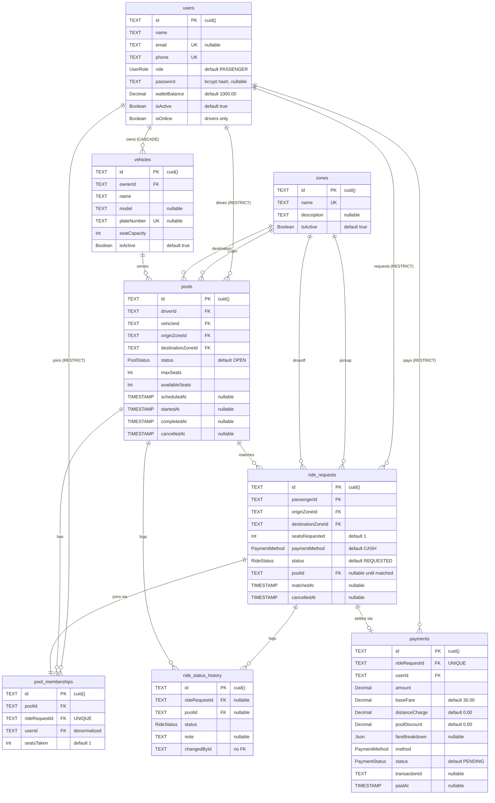

# Dhaka Tesla Pool — Database Design (PostgreSQL)

Describes the schema that is actually implemented. The source of truth is
[`backend/prisma/schema.prisma`](../backend/prisma/schema.prisma) and the
DDL applied by
[`20260929151000_step07_baseline`](../backend/prisma/migrations/20260929151000_step07_baseline/migration.sql).
Where this document and those two files disagree, they are wrong.

> **Note on naming.** Columns are camelCase and tables are snake_case. Only the
> table names are remapped, via `@@map` on each model. Column names are the
> Prisma field names, unmodified — the SQL is `"availableSeats"`, not
> `available_seats`. The first draft of this document specified snake_case
> columns throughout; that was never built.

## 1. Entity-Relationship Diagram



## 2. Table-by-table schema

The real DDL, abbreviated to the columns that carry meaning. Enum types and
`createdAt`/`updatedAt` on every table are omitted for readability. Full text
is in the migration.

```sql
CREATE TABLE "users" (
    "id"            TEXT PRIMARY KEY,          -- cuid(), generated in Prisma
    "name"          TEXT NOT NULL,
    "email"         TEXT UNIQUE,               -- nullable: drivers may omit it
    "phone"         TEXT NOT NULL UNIQUE,
    "role"          "UserRole" NOT NULL DEFAULT 'PASSENGER',
    "password"      TEXT,                      -- bcrypt hash
    "walletBalance" DECIMAL(10,2) NOT NULL DEFAULT 1000.00,
    "isActive"      BOOLEAN NOT NULL DEFAULT true,
    "isOnline"      BOOLEAN NOT NULL DEFAULT false
);

CREATE TABLE "zones" (
    "id"          TEXT PRIMARY KEY,
    "name"        TEXT NOT NULL UNIQUE,
    "description" TEXT,
    "isActive"    BOOLEAN NOT NULL DEFAULT true
    -- No lat/lng. See "Distance without coordinates" below.
);

CREATE TABLE "vehicles" (
    "id"           TEXT PRIMARY KEY,
    "ownerId"      TEXT NOT NULL REFERENCES "users"("id") ON DELETE CASCADE,
    "name"         TEXT NOT NULL,
    "model"        TEXT,
    "plateNumber"  TEXT UNIQUE,
    "seatCapacity" INTEGER NOT NULL
);

CREATE TABLE "pools" (
    "id"                TEXT PRIMARY KEY,
    "driverId"          TEXT NOT NULL REFERENCES "users"("id") ON DELETE RESTRICT,
    "vehicleId"         TEXT NOT NULL REFERENCES "vehicles"("id") ON DELETE RESTRICT,
    "originZoneId"      TEXT NOT NULL REFERENCES "zones"("id") ON DELETE RESTRICT,
    "destinationZoneId" TEXT NOT NULL REFERENCES "zones"("id") ON DELETE RESTRICT,
    "status"            "PoolStatus" NOT NULL DEFAULT 'OPEN',
    "maxSeats"          INTEGER NOT NULL,
    "availableSeats"    INTEGER NOT NULL,
    "scheduledAt"       TIMESTAMP(3),
    "startedAt"         TIMESTAMP(3),
    "completedAt"       TIMESTAMP(3),
    "cancelledAt"       TIMESTAMP(3)
    -- No `version` column. Concurrency uses a conditional UPDATE, not an
    -- optimistic version counter. See "Seat capacity" below.
);

CREATE TABLE "ride_requests" (
    "id"                TEXT PRIMARY KEY,
    "passengerId"       TEXT NOT NULL REFERENCES "users"("id") ON DELETE RESTRICT,
    "originZoneId"      TEXT NOT NULL REFERENCES "zones"("id") ON DELETE RESTRICT,
    "destinationZoneId" TEXT NOT NULL REFERENCES "zones"("id") ON DELETE RESTRICT,
    "seatsRequested"    INTEGER NOT NULL DEFAULT 1,
    "paymentMethod"     "PaymentMethod" NOT NULL DEFAULT 'CASH',
    "status"            "RideStatus" NOT NULL DEFAULT 'REQUESTED',
    "poolId"            TEXT REFERENCES "pools"("id") ON DELETE SET NULL
);

CREATE TABLE "pool_memberships" (
    "id"            TEXT PRIMARY KEY,
    "poolId"        TEXT NOT NULL REFERENCES "pools"("id") ON DELETE CASCADE,
    "rideRequestId" TEXT NOT NULL UNIQUE REFERENCES "ride_requests"("id") ON DELETE CASCADE,
    "userId"        TEXT NOT NULL REFERENCES "users"("id") ON DELETE RESTRICT,
    "seatsTaken"    INTEGER NOT NULL DEFAULT 1,
    CONSTRAINT "pool_memberships_poolId_userId_key" UNIQUE ("poolId", "userId")
);

CREATE TABLE "ride_status_history" (
    "id"            TEXT PRIMARY KEY,
    "rideRequestId" TEXT REFERENCES "ride_requests"("id") ON DELETE CASCADE,
    "poolId"        TEXT REFERENCES "pools"("id") ON DELETE CASCADE,
    "status"        "RideStatus" NOT NULL,
    "note"          TEXT,
    "changedById"   TEXT   -- deliberately not an FK; see note below
);

CREATE TABLE "payments" (
    "id"             TEXT PRIMARY KEY,
    "rideRequestId"  TEXT NOT NULL UNIQUE REFERENCES "ride_requests"("id") ON DELETE RESTRICT,
    "userId"         TEXT NOT NULL REFERENCES "users"("id") ON DELETE RESTRICT,
    "amount"         DECIMAL(10,2) NOT NULL,
    "baseFare"       DECIMAL(10,2) NOT NULL DEFAULT 30.00,
    "distanceCharge" DECIMAL(10,2) NOT NULL DEFAULT 0.00,
    "poolDiscount"   DECIMAL(10,2) NOT NULL DEFAULT 0.00,
    "fareBreakdown"  JSONB,
    "method"         "PaymentMethod" NOT NULL,
    "status"         "PaymentStatus" NOT NULL DEFAULT 'PENDING',
    "transactionId"  TEXT,
    "paidAt"         TIMESTAMP(3)
);
```

## 3. Constraints that exist

Only unique indexes and foreign keys. Notably, **there are no `CHECK`
constraints anywhere in the schema** — no `CHECK (availableSeats >= 0)`, no
`CHECK (seatCapacity > 0)`, no `CHECK (seatsRequested > 0)`. An earlier draft
of this document claimed all three. They are not in the migration, and they
are not in `schema.prisma`. Seat arithmetic is trusted to application code.

| Index | Purpose |
| --- | --- |
| `users_email_key` | One account per email, where an email exists |
| `users_phone_key` | One account per phone number |
| `zones_name_key` | Zone names are unique |
| `vehicles_plateNumber_key` | One vehicle per plate |
| `pool_memberships_rideRequestId_key` | **A ride joins at most one pool** |
| `pool_memberships_poolId_userId_key` | **A user joins a given pool at most once** |
| `payments_rideRequestId_key` | **A ride is settled at most once** |

The three bold rows are the database backstop for the matching engine. They
are what make double-joining a physical impossibility rather than a
convention — a violation surfaces as a unique-constraint error, mapped to
HTTP 409 in `src/middleware/errorHandler.ts`.

Foreign keys use three different delete behaviours deliberately:

- `CASCADE` on `vehicles.ownerId` and the three children of `pools` and
  `ride_requests` — deleting a user or a pool should not leave orphans.
- `RESTRICT` on the participant references (`pools.driverId`,
  `ride_requests.passengerId`, `payments.userId`) — refusing to delete a user
  with financial or operational history is safer than cascading it.
- `SET NULL` on `ride_requests.poolId` — a cancelled ride survives the pool it
  was matched to, with the link cleared.

## 4. Design notes

### Money is `Decimal(10,2)`, not integer poysha

Every monetary column is `DECIMAL(10,2)`. An earlier draft of this document
specified integer poysha with a `GENERATED ALWAYS AS (...) STORED` fare
column. No generated columns exist in the schema. Poysha appears only as a
transient intermediate inside
[`src/utils/estimateFare.ts`](../backend/src/utils/estimateFare.ts) and never
reaches a column.

`Decimal` rather than `FLOAT`, so fares sum exactly. `NUMERIC(10,2)` rather
than `NUMERIC(12,0)`, because the column is the unit of account.

### Seat capacity is enforced by a conditional `UPDATE`

There is no `version` column and no `SELECT ... FOR UPDATE`. The last seat is
claimed by making the capacity check part of the write itself
(`src/services/pool.service.ts`):

```ts
const result = await tx.pool.updateMany({
  where: {
    id: poolId,
    status: PoolStatus.OPEN,
    availableSeats: { gte: rideRequest.seatsRequested },
  },
  data: { availableSeats: { decrement: rideRequest.seatsRequested } },
});
if (result.count === 0) throw new AppError("Not enough seats left in this pool", 409);
```

Under PostgreSQL's default `READ COMMITTED` isolation, a writer that blocks
on a row lock re-evaluates its `WHERE` clause against the version the winner
committed. The loser's `availableSeats >= seatsRequested` no longer matches,
`count` is 0, and the transaction rolls back. The check and the write are the
same statement, so they cannot disagree.

`tests/integration/concurrentSeatClaim.test.ts` proves this: it takes a real
row lock from a separate connection, asserts the service call stays blocked,
then asserts it returns 409 after the lock is released.

The same pattern guards driver lifecycle transitions, seat release on
cancellation, and the wallet debit. Lock order is consistent — pool row first,
then ride request row — so those transactions cannot deadlock against each
other.

### Distance without coordinates

`zones` has no `lat`/`lng`. A zone is a named area, and distance comes from
[`src/config/fareConfig.ts`](../backend/src/config/fareConfig.ts), a
hand-written table of zone-pair distances in km, defaulting to 5. Whether two
zones can share a pool is decided by a static cluster map in
[`src/config/zoneClusters.ts`](../backend/src/config/zoneClusters.ts).

This is a deliberate simplification, and it is the weakest part of the data
model. It works because Dhaka's zones are well known and the set is small and
fixed; it would not survive a city where zones are arbitrary, and it cannot
compute a fare for a pair the table does not list.

### `userId` on `pool_memberships` is denormalized

`pool_memberships` can reach `users` through `ride_requests.passengerId`. The
denormalized copy is there so "which pools is this user in?" is a single
indexed lookup instead of a join. The cost is that the application must keep
the two in step; nothing in the database enforces that they agree.

### `ride_status_history.changedById` has no foreign key

Deliberate. History should outlive the account that produced it, and a
restrict-delete on an audit column would make users undeletable. The cost is
that the column can name a user who no longer exists.

### `users.email` is nullable, `users.phone` is not

Phone is the required identifier, because this is a ride-hailing product in
Bangladesh and phone is how a driver and a passenger reach each other. Email
is optional.

## See also

- [`architecture.md`](./architecture.md) — system-level design, layering, and
  why there is no Redis, queue or microservice layer
- [`testing.md`](./testing.md) — how the concurrency guarantees above are tested
